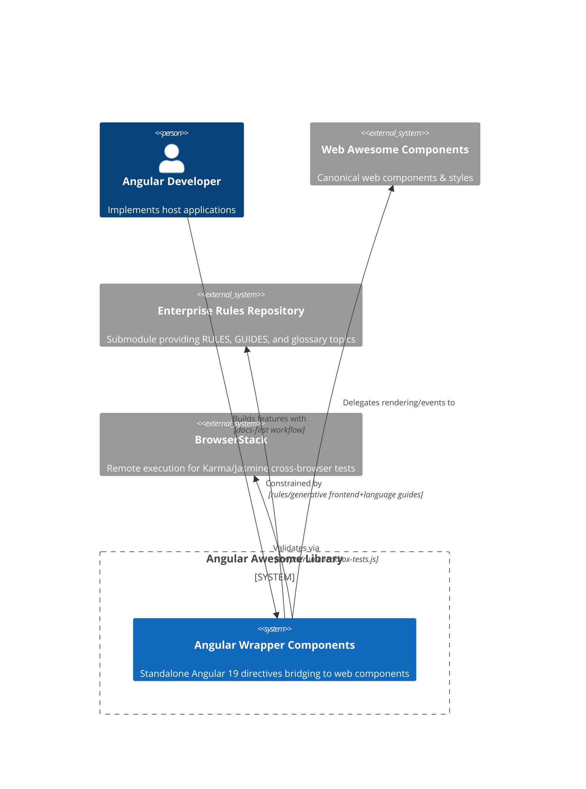

# Angular Awesome — C4 Context

Angular Awesome wraps the Web Awesome web components so Angular teams can rely on enterprise-approved UI primitives. The Rules Repository under `rules/` drives every change, so this diagram anchors host documentation for the stage-gated workflow described in `GUIDES.md`.

## Traceability

- `PACT.md`, `RULES.md`, `GUIDES.md`, and `IMPLEMENTATION.md` must reference this diagram to satisfy the documentation loop mandated in `rules/README.md`.
- Updates to Web Awesome APIs require a forward-only refresh of this diagram plus downstream docs in the same change set.
